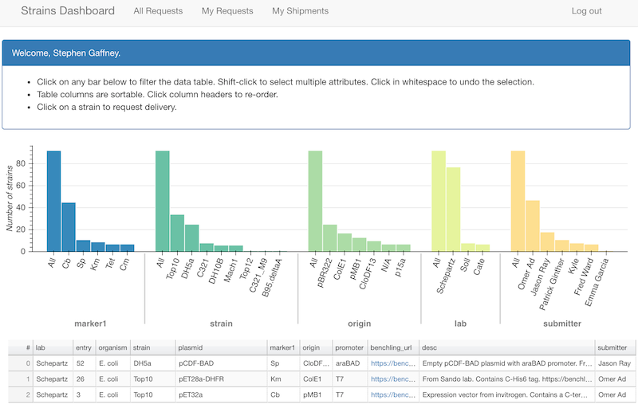

# The C-GEM Strains app



This app consists of two sub-apps which must run simultaneously:
- a Bokeh server app, with code in `bk_server`;
- a Flask app, with code in `oauth`.

The Bokeh server app is used to generate the interactive bar chart and table on 
the homepage. It interacts with the user-facing Flask app, which provides the 
rest of the application interface and responds to HTTP requests. 

## Setup instructions

### Python package dependencies

The code in this repository assumes a Python 3 environment. You can use either 
`conda` or `pip` as described below.

#### Dependencies via `conda`

You can replicate the environment used to run the C-GEM Strains app by using conda
to install the virtual environment specified by the supplied environment file, 
`environment.lock.yaml`. This file specifies all dependendices, including 
precise version numbers.

With a Conda distribution installed, you can create a virtual environment as
follows:

```bash
conda env create -n strains -f environment.lock.yaml
```

Activate the environment using `conda activate strains`.

#### Dependencies via `pip`

As an alternative to conda, you can use pip to install dependencies, using:
```bash
pip install -r requirements.txt
```


### Environment file

A single environment file (.env) is used to specify all variables specific to 
your server. A demo file (`.env.demo`) has been provided, which you should 
update and rename to `.env`. If you wish to keep multiple env files to define
different setups (e.g. a development environment), this is also possible by 
setting the ENV_NAME environment variable -- e.g. `export ENV_NAME=.env.dev` will
cause the bokeh server and flask app to use the configuration in a file called 
`.env.dev` in the root source directory. 

The environment file is used to specify:
- your flask environment (i.e. 'development', 'testing', or 'production')
- the location of your python virtual environment (full path to directory that
includes the bin/ and lib/ subdirectories).
- the URL where the app will be made available (could be 'localhost')
- the server address (e.g. 'localhost' or IP address)
- port numbers for running the Bokeh server and Flask app
- a location for saving a local copy of downloaded strains data
- the path to a GSuite credentials file, in JSON format. The corresponding user 
must have read permission on the corresponding Strains sheet in Team Drive.
- a username for service account authorization
- the local URL for the bokeh server
- development and production database details
- the id ('group key') for the Team Drive, used by the Directory API
- mail server configuration for user alerts


### Database setup

Database tables (used for tracking shipment requests and discussion) 
are defined in `oauth/models.py` and will be created automatically by 
SQLAlchemy, triggered by the line `db.create_all()` at the end of the module. 
Before running the apps for the first time, first make sure that you have 
created the database using the credentials you provided in the env file.


### Running the apps

If you are using a custom environment file (as described above), remember to 
set the `ENV_NAME` environment variable prior to starting the apps.

The Bokeh server app should be started first, and can be initiated by running 
the `start_strains_bokeh.sh` script. This sets up the environment and runs 
the appropriate `bokeh serve` command to start the Bokeh server.

The Flask app can be initiated by running the `start_strains.sh` script, which
contains the appropriate `flask run` command.

Once both components are running, the combined app will be accessible in your 
browser at the URL you specified in the env file.
